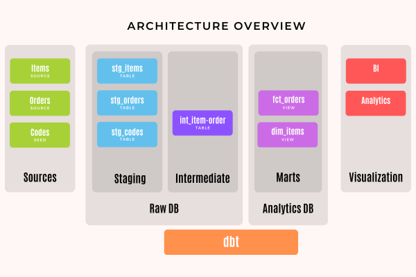

# Retail Data Analytics Project (Proof of Concept)

A set of data analytics pipelines for retail data, leveraging Snowflake and dbt.
The project adheres to best practices such as data quality tests and code promotion between environments.

In this project, we use a sample retail dataset (TPC-H dataset from TPC Benchmark), transforming it into a consumable orders model ready for visualization. This is a fully functional dbt project complete with testing and documentation, and it provides dedicated development and production environments.

## Architecture Overview

Files, folders, and dbt models are organized into layers: Staging, Intermediate, Marts.
Tables and views in the staging and intermediate layers are stored in the "Raw" database,
while objects in the Marts layer reside in the "Analytics" database.

Three roles are defined in the project: Loader, Transformer, and Reporter.
Each role has specific responsibilities and access rights:

- **Loader:** Responsible for loading data into the system.
This role does not have access to analytics databases.

- **Transformer:** Manages the transformation of data and populates the analytics databases.
This role serves as the bridge between the raw and analytics databases.

- **Reporter:** Exclusively focused on reporting and visualization. This role does not have access to the raw database.

The analytics database is populated by the Transformer, and each role uses its own warehouse.

## Key Features:

- Data transformation organized in layers in the models directory

    **Staging** — initial modular building blocks from source data
    **Intermediate** — preparation of staging models, normalization of data to join
    **Marts** — combination of previous pieces into a rich vision of information

- Two databases

    **raw** Landing pad for everything extracted and loaded including external stages for data living in S3.
    Access to this database is strictly permissioned.
    **analytics** Tables and views accessible to analysts and reporting. Everything in analytics is created and owned by dbt.

- Role-Based access, each role with specific responsibilities and access rights.
    **loader**
    Owns the tables in your raw database, and connects to the loading warehouse.
    **transformer**
    Has query permissions on tables in raw database and owns tables in the analytics database.
    This is for dbt developers and scheduled jobs.
    **reporter**
    Has permissions on the analytics database only.
    This role is for data consumers, such as analysts and BI tools.
    These users will not have permissions to read data from the raw database.

- Separated warehouses. Each role uses a separated warehouse (*loading*, *transforming*, *reporting*)
as each stage can put significant strain on a warehouse and affect others users.

- Dedicated Environments: development and production environments for a structured and controlled data workflow.

## Getting Started

1. Set up a Snowflake project that includes:
   - RAW and ANALYTICS databases.
   - Each database has two schemas: DEV and PROD.
   - LOADING, TRANSFORMING, REPORTING warehouses.

2. Set up a project in dbt Cloud, with:
   - a git repository for version control of dbt models.
   - a connection to Snowflake.

3. Copy the contents of this repository to the one associated with the dbt account and commit the file.
4. Run `dbt seed`, `dbt test`, `dbt docs generate`, `dbt run`.

## References

https://www.getdbt.com/blog/how-we-configure-snowflake
