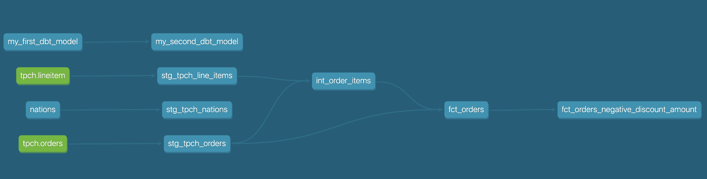

# Data Engineering with *Snowflake* and *dbt*

A set of data analytics pipelines for retail data leveraging dbt and Snowflake,
making use of best practices like data quality tests and code promotion between environments

## Requirements
- Project in dbt Cloud, with
- - a connection to Snowflake, including account, database, warehouse, user, password, developer schema
- - a GitHub repository
- Install and configure `snowsql`
- - add a profile `snowflake-p01` to `~/.dbt/profiles.yml`
- - configure dbt\_profile with profile name and dbt\_Cloud project number.
- - set up snowflake environment: database, schema, warehouse
- - `./dbt run` should run successfully
